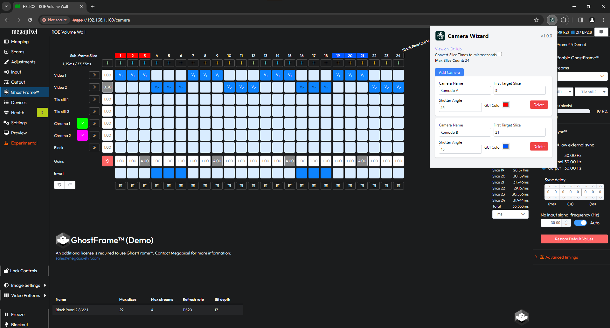

# Megapixel Camera Wizard Extension

## Overview
The Megapixel Camera Wizard is a Chrome extension designed to enhance the user interface of the Camera Mode GUI on a Megapixel Helios LED processor. It provides functionality such as converting subframe timings from milliseconds to microseconds, managing multiple camera settings, and visually representing camera configurations in the GUI.

## Features
- **Toggle Conversion**: Convert subframe timings between milliseconds and microseconds.
- **Camera Management**: Add, delete, and manage multiple camera settings including camera name, target first slice, shutter angle, and a unique color identifier.
- **GUI Enhancement**: Visually modify the web-based control system's interface based on the user-defined camera settings.
- **Dynamic Slice Count Handling**: Automatically updates the maximum slice count based on changes in the web interface.
- **User-Friendly Interface**: An easy-to-use popup interface for managing cameras and settings.

## Installation
1. Clone or download the repository.
2. Open Chrome and navigate to `chrome://extensions/`.
3. Enable Developer Mode.
4. Click "Load unpacked" and select the `extension` folder from the cloned repository.
5. The extension should now be installed and visible in your Chrome toolbar.

## Usage
- Click on the extension icon in the Chrome toolbar to open the popup interface.
- Use the toggle checkbox to convert subframe timings.
- Add, configure, or delete cameras using the provided interface in the popup.
- The changes will be reflected in the web-based camera control system's interface.

## Screenshots

## Contributing
Contributions to the Megapixel Camera Wizard are welcome!

## License
This project is licensed under the [MIT License](LICENSE) - see the LICENSE file for details.

## Acknowledgments
- Special thanks to everyone who contributed to the development and testing of this extension.
